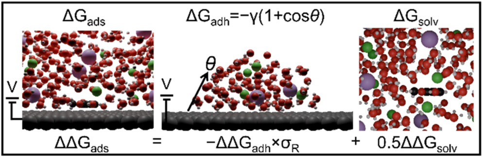
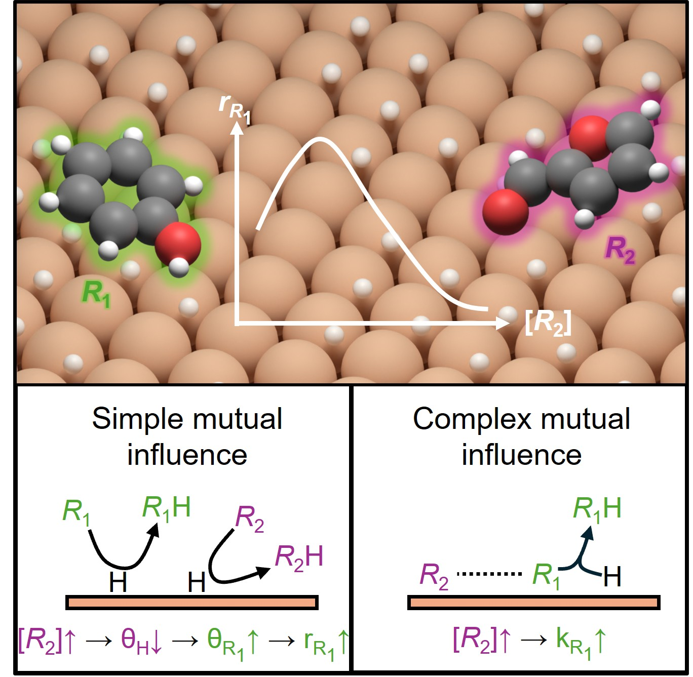
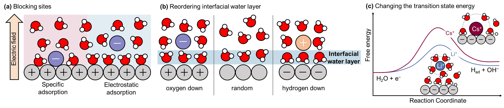

<!--
**ankitmathanker/ankitmathanker** 
-->
# Hi there 🙏!! I am ANKIT MATHANKER 🧑‍💻

---

## 🎓 Summary
I am a Ph.D. candidate in the Department of Chemical Engineering at the University of Michigan. During my Ph.D. studies, I have focused on investigating various heterogeneous catalysis systems at the atomistic level using tools such as density functional theory, molecular dynamics, and machine learning. In my Master's, I studied pyrolysis and liquefaction processes, along with characterization techniques for biofuels and bitumen upgrading.

---
## 📫Reach me out via
- Email: [ankitma@umich.edu](mailto:ankitma@umich.edu)
- [CV](https://github.com/ankitmathanker/ankitmathanker/blob/main/assets/Mathanker_CV.pdf)

---
## 🗣️ Upcoming Talks & Poster Presentations

### GRC AI for Materials, Energy, and Chemical Sciences - 2026
#### **Poster**
**Title:** *Estimating potential-dependent physicochemical properties at metal/electrolyte interfaces using machine learning interatomic potentials*  
🗓️ **Date : Time:** *Feburary 1-6, 2026, TBD*
<!-- **Session:** *253d - Electrocatalysis V: Atomistic Insights at Electrochemical Interfaces* -->
<!-- 🗓️ **Date & Time:** *Tuesday, November 4, 2025, 8:54 AM – 9:12 AM* -->  
📍 **Location:** *2024 Seawall Boulevard, Galveston, Texas, USA*

---

## 🔭 Education

-   **Doctoral of Philosophy Candidate (Chemical Engineering)** | Aug 2021 – Present
    *University of Michigan, USA* | *GPA: 4.0/4.0*

-   **Master of Science (Chemical Engineering)** | Jan 2018 – Jan 2020
    *University of Alberta, Canada* | *GPA: 3.8/4.0*

-   **Bachelor of Technology (Chemical Engineering)** | Jul 2013 – May 2017
    *IIT (ISM) Dhanbad, India* | *GPA: 8.9/10.0*

---

## 🌱 Skills

-   **Atomistic Modeling:** Atomic Simulation Environment, Pymatgen, VASP, JDFTx, GROMACS, MACE, DeePMD-kit, Microkinetic modeling
-   **High-throughput Computing:** Slurm, PBS, LSF
-   **Data Science/Machine Learning:** Python (Pandas, NumPy, SciPy, scikit-learn), MATLAB

---

## 🔬Research Experience

-   **Graduate Research Assistant**, University of Michigan, USA | Aug 2021 – Present
   -   Understanding the effect of electrode potential, electrolyte species, and co-reactants on the electrocatalytic hydrogenation of organics using density functional theory, molecular dynamics, and machine learning.

-   **Graduate Intern**, Lawrence Livermore National Laboratory, USA | Jun – Aug 2024
    -   Estimating potential-dependent water adsorption isotherms and the nature of O–H bond characteristics at electrolyte-metal interfaces on using MACE-trained machine learning interatomic potentials.(Ongoing)

-   **Research Assistant**, University of Alberta, Canada | Oct 2020 – Mar 2021
    -   Optimized process parameters to investigate the synergistic impact of agricultural and forest residue on hydrothermal liquefaction. Implemented regression models to establish correlations.

-   **Graduate Research Assistant/ Research Assistant**, University of Alberta, Canada | Jan 2018 – Jan 2021
    -   Investigate the synergistic impact of agricultural and forest residue on hydrothermal liquefaction using supercritical water medium in an autoclave reactor.

-   **Research Assistant (Indian Academy of Science Fellow)**, IIT Guwahati, India | May – Jul 2016
    -   Investigated the synthesis of low-cost tubular ceramic membrane (TCM) via the extrusion process. Experimentally and analytically measured water flux and porosity.

-   **Undergraduate Dissertation**, IIT (ISM) Dhanbad, India | May 2016 – Apr 2017
    -   Synthesized PEI-impregnated adsorbents for CO2 capture and simulated adsorbent packed bed for CO2 adsorption on Aspen Adsorption.

---

## 📰Publications

1.  **Mathanker, A.**; Sharma, G.; Tran, B.; Singh, N.; Goldsmith, B. R. [Effect of ions on the aqueous-phase adsorption of small aromatic organics on silver.](https://pubs-acs-org.proxy.lib.umich.edu/doi/full/10.1021/acs.jpcc.5c02870) *J. Phys. Chem. C* 2025, 129, 29, 13433-13444.

  

2.  **Mathanker, A.**; Halarnkar, S.; Tran, B.; Singh, N.; Goldsmith, B. R. [Synergistic effects in organic mixtures for enhanced catalytic hydrogenation and hydrodeoxygenation.](https://doi.org/10.1016/j.checat.2024.101135) *Chem Catalysis* 2024, 4, 101135.

  

3.  **Mathanker, A.**; Yu, W.; Singh, N.; Goldsmith, B.R. [Effects of ions on electrocatalytic hydrogenation and oxidation of organics in aqueous phase.](https://doi.org/10.1016/j.coelec.2023.101347) *Curr. Opin. Electrochem.* 40, 101347 (2023).

  

4.  Das, S.; **Mathanker, A.**; Pudasainee, D.; Khan M.; Kumar, A.; Gupta, R. [Synergistic effect of water and co-solvents on the hydrothermal liquefaction of agricultural biomass to produce heavy oil.](https://www.dl.begellhouse.com/references/6d18a859536a7b02,29f9221e318e21e7,61e800753c7b9f7a.html) *International Journal of Energy for a Clean Environment* 2022, 23(4):31-45.
5.  **Mathanker, A.**; Das, S.; Pudasainee, D.; Khan, M.; Gupta, R. [A review on hydrothermal liquefaction of biomass for biofuels production with special focus on the effect of process parameters, co-solvents and extraction solvents.](https://www.mdpi.com/1996-1073/14/16/4916) *Energies* 2021, 14, 4916.
6.  **Mathanker, A.**; Pudasainee, D.; Kumar, A.; Gupta, R. [Hydrothermal liquefaction of lignocellulosic biomass feedstock to produce biofuels: Parameter study and products characterization.](https://doi.org/10.1016/j.fuel.2020.117534) *Fuel* 2020, 271, 117534.
7.  **Mathanker, A.** Hydrothermal liquefaction of lignocellulosic biomass to produce biofuels. *Thesis* 2020.

---

## Seminar Talks

1.  **Mathanker, A.** [Can aqueous ions modify the adsorption of organics on Ag?](https://lindseylab.engin.umich.edu/csidir-seminars/) The Student and Postdoc Summer Seminar Series, CSiDIR, 2025, University of Michigan, Ann Arbor, MI, USA.

---
